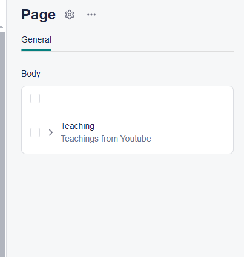
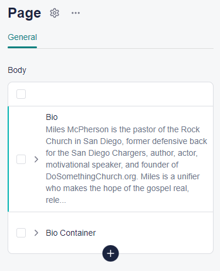

# Storyblok Structure Documentation

# Story Overview For `Home Page`

- **Story Name:** Landing
- **ID:** 534784302
- **UUID:** 87be9233-05b1-4d86-8408-b64b7370477f
- **Created At:** 2024-08-13T04:09:36.237Z
- **Published At:** 2024-08-24T17:42:17.388Z

## Content Structure

### 1. Hero Component

- **\_uid:** 895dee6a-6ccb-4fac-9279-7b60d38461fe
- **Component Name:** `Hero`
- **Fields:**
  - **qoute:** `String` - The quote text
  - **backgroundImage:** `Asset` - Image details:
    - **id:** 7334719
    - **filename:** `/hero-background.jpg`
    - **source:** `Storyblok`

### 2. Bio Component

- **\_uid:** f02a8732-b2fa-4976-ba8c-899357edd98a
- **Component Name:** `Bio`
- **Fields:**
  - **history:** `String` - Biography or history text
  - **sideImage:** `Asset` - Image details:
    - **id:** 7334721
    - **filename:** `/bio-side-image.jpg`
    - **source:** `Storyblok`

### 3. Message Component

- **\_uid:** e80ef996-3059-41bf-9c98-3910644acc73
- **Component Name:** `Message`
- **Fields:**
  - **titile:** `String` - Title of the message
  - **message:** `String` - Main message content
  - **videoLink:** `Multilink` - URL of a video

### 4. Teaching Component

- **\_uid:** 3ac297b4-b3ec-4abb-8f13-65f4ec9729e6
- **Component Name:** `Teaching`
- **Fields:**
  - **churchLogo:** `Asset` - Image details:
    - **id:** 7334722
    - **filename:** `/church-logo.jpg`
    - **source:** `Storyblok`
  - **description:** `String` - Description of the teachings
  - **TeachingVideos:** `Array` - List of `video` components containing video links

### 5. Articles Component

- **\_uid:** 355ead21-ba41-4531-bcfb-a1219b6fb6ce
- **Component Name:** `Articles`
- **Fields:**

  - **churchLogo:** `Asset` - Image details:
    - **id:** 7334723
    - **filename:** `/articles-logo.jpg`
    - **source:** `Storyblok`
  - **description:** `String` - Description of the articles section
  - **ArticlesCard:** `Array` - List of `ArticleCard` components containing article details

### 6. ArticleCard Component (Within the Articles Component)

- **\_uid:** 409c251c-3f3c-46e0-8261-9071f496d353
- **Component Name:** `ArticleCard`
- **Fields:**
  - **title:** `String` - Title of the article
  - **postDate:** `String` - Date when the article was posted
  - **thumbnail:** `Asset` - Image details:
    - **id:** 7334724
    - **filename:** `/article-thumbnail.jpg`
    - **source:** `Storyblok`
  - **cardDescription:** `String` - Description of the article
  - **teachingContent:** `Array` - List of text items for the article content

# Story Overview For `Teaching Page`

- **Story Name:** Teaching
- **ID:** 535847626

## Content Structure

### 1. Page Component

- **\_uid:** b960faec-dfc4-4144-809e-6f34b3bfe99b
- **Component Name:** `page`
- **Fields:**
  - **body:** Teaching Component - A component which wrapup every thing inside the page.

### 2. Teaching Component (Within the Page)

- **\_uid:** d81f93f2-168d-43c5-b1f9-3fac781707dd
- **Component Name:** `Teaching`
- **Fields:**
  - **churchLogo:** `Asset` - Image details:
    - **id:** 16994640
    - **filename:** `https://a.storyblok.com/f/300448/640x640/7a1e25241b/church_logo.jpg`
    - **source:** `Storyblok`
  - **description:** `String` - "Teachings from Youtube"
  - **TeachingVideos:** `Array` - List of `video` components containing video links.

### 3. Video Component (Within the Teaching Component)

- **\_uid:** 6e4c7890-155e-4a2a-83de-a135d20308dd
- **Component Name:** `video`
- **Fields:**
  - **videoLink:** `Multilink` - URL of a video:
    - **url:** `https://www.youtube.com/watch?v=uV4L-wcnK3Y&pp=ygUlaG93IHRvIGJ1aWxkIGFuIGV4dGVuc2lvbiBmb3IgY2hyb21lIA%3D%3D`
    - **linktype:** `url`
    - **cached_url:** `https://www.youtube.com/watch?v=uV4L-wcnK3Y&pp=ygUlaG93IHRvIGJ1aWxkIGFuIGV4dGVuc2lvbiBmb3IgY2hyb21lIA%3D%3D`

## Summary of Field Types

- **String:** Text fields like the description.
- **Asset:** Media files with properties like `id`, `filename`, `source`, etc.
- **Multilink:** Links to external resources (e.g., video links).
- **Array:** Lists of items, each representing a sub-component or content block.

# Story Overview For `Article Page`

- **Story Name:** Article
- **ID:** 535866111

## Content Structure

### 1. Page Component

- **\_uid:** 93a695e4-3a09-4abc-9a98-ce6c29d1120f
- **Component Name:** `page`
- **Fields:**
  - **body:** Articles Component - A component which wraps everything inside the page.

### 2. Articles Component (Within the Page)

- **\_uid:** 604d324a-16be-4769-8c29-8bbce52725b1
- **Component Name:** `Articles`
- **Fields:**
  - **churchLogo:** `Asset` - Image details:
    - **id:** 16994640
    - **filename:** `https://a.storyblok.com/f/300448/640x640/7a1e25241b/church_logo.jpg`
    - **source:** `Storyblok`
  - **description:** `String` - "As you begin the steps to selling, learn what to expect with our Sellers Guide"
  - **ArticlesCard:** `Array` - List of `ArticleCard` components containing article details.

### 3. ArticleCard Component (Within the Articles Component)

- **\_uid:** 2b393790-34b5-4038-8e89-d3d8cb1b0178 (Example for one card)
- **Component Name:** `ArticleCard`
- **Fields:**
  - **title:** `String` - "ዕውቀት ማጣት"
  - **thumbnail:** `Asset` - Image details:
    - **id:** 17000843
    - **filename:** `https://a.storyblok.com/f/300448/1280x900/3d0b44bcd2/teaching.jpg`
    - **source:** `Storyblok`
  - **cardDescription:** `String` - "እግዚአብሔር ፈጣሪ ነው። ነገር ግን ፈጣሪ ብቻ አይደለም። አዳሽም ነው! የፈጠረው ቢበላሽ ይሠራዋል፣ ቢሰበር ..."

# Story Overview For `About Page`

- **Story Name:** About
- **ID:** 536580504
- **UUID:** c2740e99-d498-40f2-9be6-61c0797ab57c
- **Created At:** 2024-08-18T07:31:34.601Z
- **Published At:** 2024-08-18T07:47:14.711Z

## Content Structure

### 1. Page Component

- **\_uid:** d4ef2926-7604-45bd-b143-de9d57a2d850
- **Component Name:** `page`
- **Fields:**
  - **body:** Bio Component - Contains biographical details and related content.
    - _Bio_
    - _BioContainer_

### 2. Bio Component (Within the Page)

- **\_uid:** b0d239cb-77d9-4899-9cfe-70a16ce48f92
- **Component Name:** `Bio`
- **Fields:**
  - **history:** `String` - Detailed biography of an individual.
  - **sideImage:** `Asset` - Image details:
    - **id:** 16994238
    - **filename:** `https://a.storyblok.com/f/300448/1280x900/fe0a806b84/reading.png`
    - **source:** `Storyblok`

### 3. BioContainer Component (Within the Page)

- **\_uid:** 84dd0a05-ea22-44c1-bbfe-a343af3f96ff
- **Component Name:** `BioContainer`
- **Fields:**
  - **BioCards:** `Array` - List of `BioCard` components containing segments of a biography.

### 4. BioCard Component (Within the BioContainer)

- **\_uid:** fe7b2de5-8f99-422d-a6d2-44efd75e9f19 (Example for one card)
- **Component Name:** `BioCard`
- **Fields:**
  - **title:** `String` - "Early Life"
  - **history:** `String` - Biography segment describing early life details.
  - **yearRange:** `String` - Time range associated with the biography segment.
  - **image:** `Asset` - Image details:
    - **id:** 17027530
    - **filename:** `https://a.storyblok.com/f/300448/4096x2731/8f7378054b/photo1.jpg`
    - **source:** `Storyblok`

